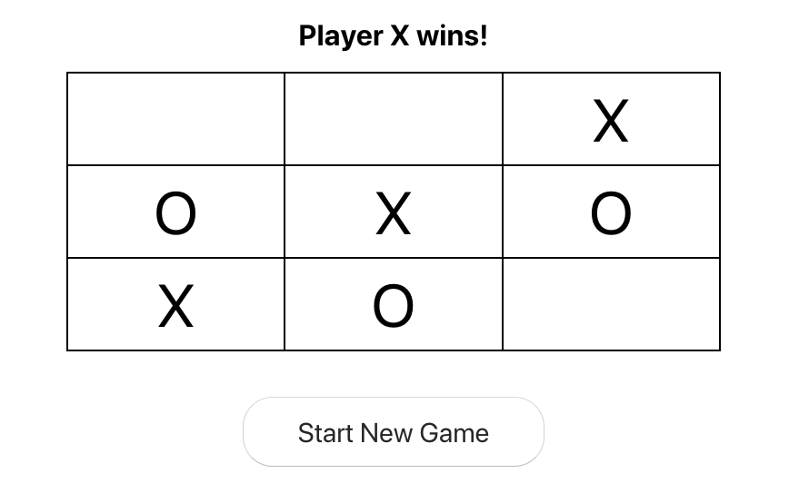

### Tic Tac Toe

This app was build using the JS framework React.

These is still some work to be done to this app to make the code more DRY, such as:

- The code is duplicated for the winning conditions

- Using callback functions which will only run after another function is completed.

- Evaluting a winner after each turn (before the next persons turn).  Right now it is only after the opponent has gone again does the game declare a winner. 

## Setting up this app on your machine

- Git clone this repo.

 - in the main directory type "npm install" to the terminal
 
 - Now simply start the app with "npm start".  
 
 - This should get the app working on your local server 3000.

